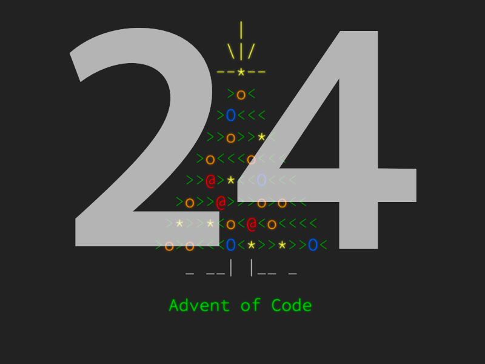

<p align="center">
    
    <br/>
    <h3 align="center">Advent Of Code 2024</h3>
</p>
<br />

<p align="center">
    <a href="../../issues"></a>
    <a href="../../pulls"></a>
    
</p>

## 📖 Description

Solutions to the [Advent of Code 2024](https://adventofcode.com/2024) challenges. Each day's challenge is contained within its own directory under `aoc24`.

- Each day has its own folder (e.g., day1, day2) with:
  - `main.py` - the Python solution for the day's challenge
  - `input.txt` - the input file used in the challenge
- `utils.py` contains common helper functions used across multiple solutions.

## 🛠️ How to Run

1. Clone this repository:

```bash
git clone https://github.com/aminbeigi/aoc24.git
cd aoc24
```

2. Install dependencies (using Poetry):

```bash
poetry install
```

3. Run the solution for a specific day:

```bash
poetry run python aoc24/day1/main.py
```

4. Run solutions for other days:
   Simply replace day1 with the desired day (e.g., day2) in the command above.

## ⚙️ Requirements

- Python 3.10+
- Poetry (for dependency management)

## 🎯 Contributions

Contributions are always welcome!  
Just make a [pull request](../../pulls).
